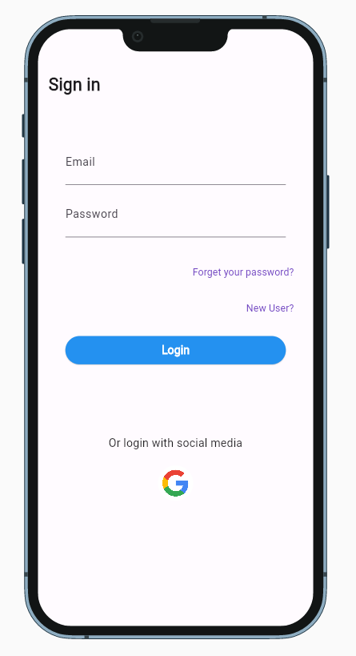
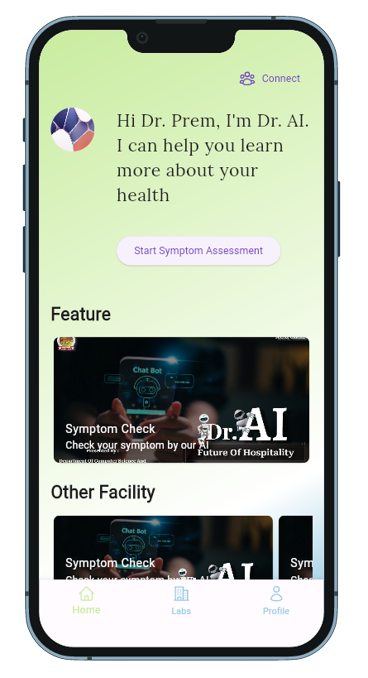
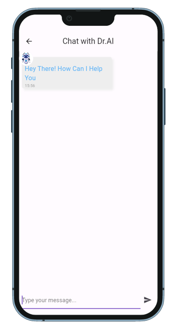
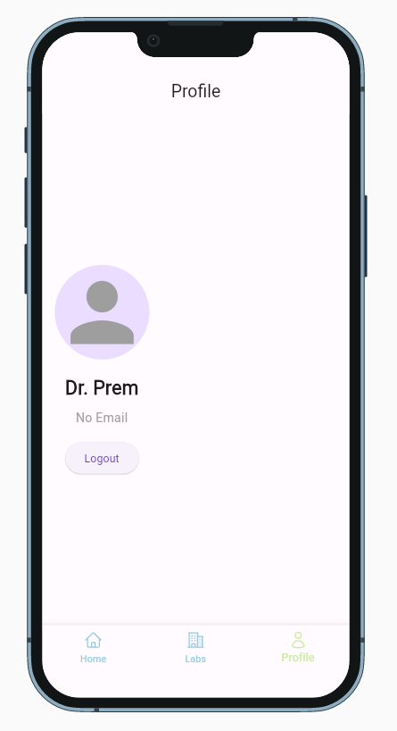
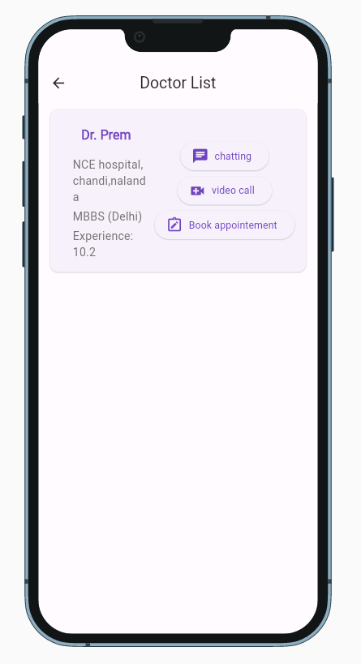

# Dr AI - Artificial Intelligence Based Chatbot

Dr AI is a telemedicine application that empowers users to connect with medical professionals and AI-driven services seamlessly. It facilitates real-time communication, symptom prediction, and appointment scheduling to provide a comprehensive healthcare experience.

## Skills Utilized

- Flutter: Building the cross-platform user interface for the application.
- Flask: Developing the backend server to manage user interactions and data.
- Flask-SocketIO: Enabling real-time messaging and communication.
- Redis: Implementing message queuing for seamless offline message delivery.
- Natural Language Toolkit (NLTK): Utilizing NLP for AI-based symptom prediction.
- Decision Trees: Enhancing symptom prediction accuracy using machine learning.
- AES Encryption: Ensuring secure communication between users and doctors.
- Firebase: Managing user data, authentication, and data synchronization.
- Speech Recognition: Enabling voice-based input for user queries.

## Screenshots


### Login Screen


### Landing Screen


### Chat with AI


### Chat with Doctor


### Profile Screen


### Doctor List



## Getting Started

To run the application locally, follow these steps:

1. **Clone the repository:**

git clone https://github.com/premprakashgupta/DrAI.git

2. **Install Dependencies:**
- Flutter: Follow the installation guide at https://flutter.dev/docs/get-started/install
- Python Dependencies: Navigate to the Flask server directory and install required packages.
  ```
  cd flask_server/
  pip install -r requirements.txt
  ```

3. **Configure the Server Endpoints:**
Open the Flutter app source code and locate the API endpoint configuration. Update the endpoints to match your local Flask server setup.

4. **Run the Flask Server:**
- Navigate to the Flask server directory:
  ```
  cd flask_server/
  ```
- Run the Flask server:
  ```
  python app.py
  ```

5. **Launch the Flutter App:**
- Navigate to the Flutter app directory:
  ```
  cd flutter_app/
  ```
- Launch the app on your preferred platform:
  ```
  flutter run
  ```

For more detailed setup instructions and additional features, please refer to the project documentation.

## Contribution

Contributions are welcome! If you find any issues or have suggestions for improvements, please feel free to create an issue or submit a pull request.

## License

This project is licensed under the [MIT License](LICENSE).

---

© 2023 Prem Prakash Gupta
